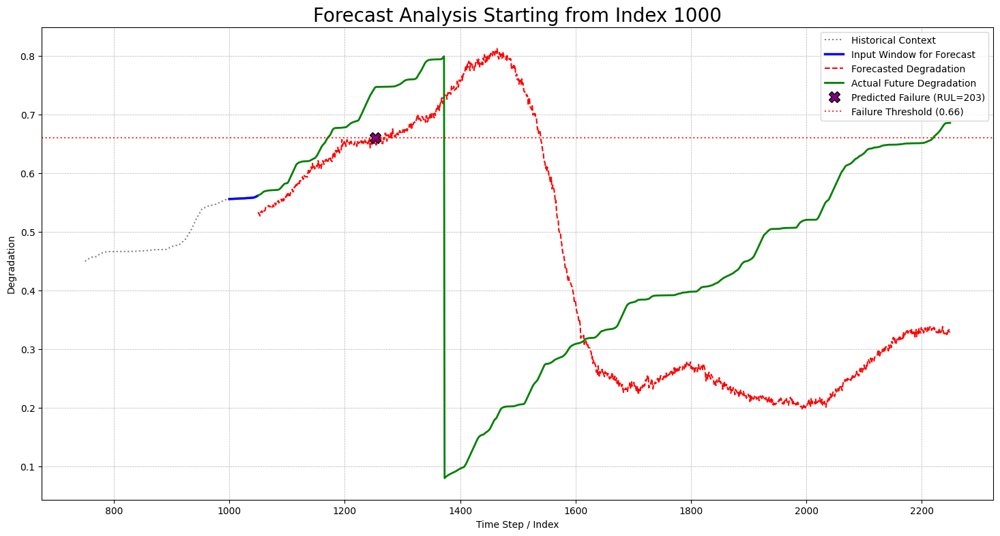
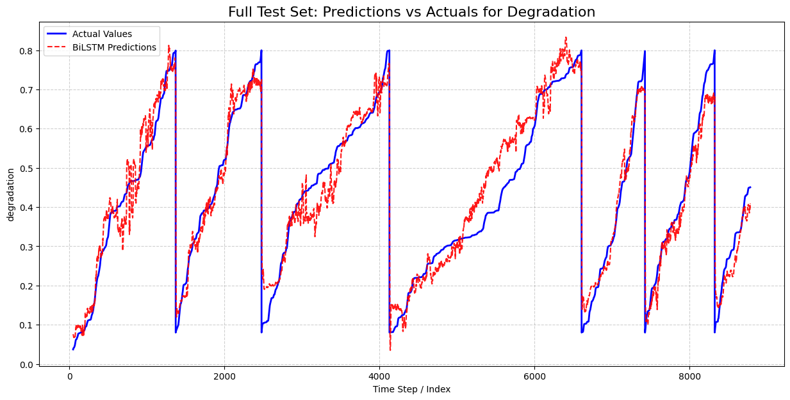
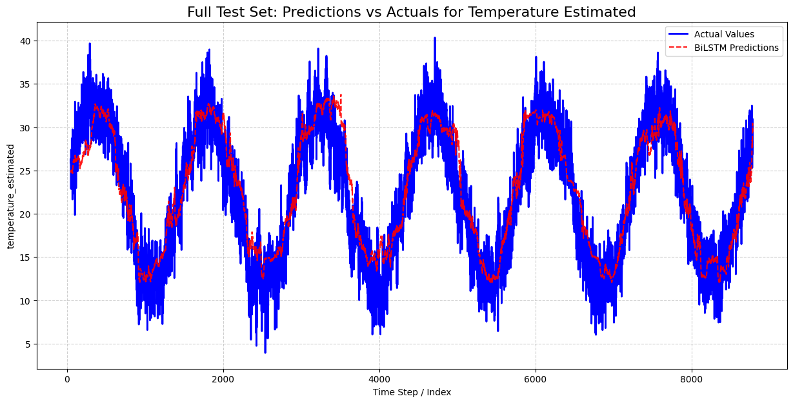

# ⚙️ Predictive Maintenance Dashboard for Wind Turbines

This repository contains the complete end-to-end pipeline for a **predictive maintenance solution** designed for wind turbine generators. It includes model development, training, and an interactive dashboard for real-time health forecasting of turbine components.

---

## 📌 Project Motivation

The primary goal is to **predict the Remaining Useful Life (RUL)** of wind turbine components using multivariate time series forecasting. By doing so, maintenance becomes proactive rather than reactive—reducing operational costs and preventing unexpected failures.

---

## 🚀 Key Features

- **Model Development:**  
  A detailed walkthrough in [`time_series_model_final.ipynb`](./NoteBook&DATA/time_series_model_final.ipynb) covering preprocessing, feature engineering, and training a BiLSTM-based Direct Multi-Step Forecasting model.

- **Interactive Streamlit Dashboard:**  
  [`app.py`](./Dashboard_App/app.py) enables users to:
  - Forecast future degradation curves and calculate RUL.
  - Visualize predicted vs actual sensor data.
  - Forecast multiple health indicators like temperature, vibration, etc.

- **Efficient Inference:**  
  The BiLSTM model predicts up to 1200 steps ahead in a single forward pass.

---

## 📊 Dashboard Demonstrations

### 🔧 RUL Prediction & Maintenance Forecast

_Visual showing degradation curve with predicted RUL point_  
**Image Placeholder:**  


---

### 🌡️ Component Health Forecasting Window

_Example of forecasting temperature and other features for the next 100 time steps_  
**Image Placeholder:**  



---

## 🗂️ Repository Structure
```bash
FINAL_PROJECT/
├── README.md # This file
├── NoteBook&DATA/
│ ├── DATA/
│ │ ├── traindata.csv
│ │ └── testdata.csv
│ └── time_series_model_final.ipynb
└── Dashboard_App/
├── app.py
├── main_scaler.joblib
└── model_BiLSTM.pth
```

---

## ⚙️ Installation

### Step 1: Clone the Repository

```bash
git clone https://github.com/Hachimboua/Dashboard_of_Wind_Turbine_Generator_Predictive_Maintenance.git
cd FINAL_PROJECT
```

Step 2: Install Required Libraries
Ensure Python 3.8+ is installed, then:

```bash
pip install pandas numpy scikit-learn torch matplotlib streamlit plotly joblib jupyter
```
🧠 How to Use the Project
📘 Stage 1: Model Training
Navigate to the notebook directory:

```bash
cd NoteBook&DATA
```
Launch Jupyter:
```bash
jupyter notebook
```

Run all cells in time_series_model_final.ipynb. This will generate:

-model_BiLSTM.pth
-main_scaler.joblib

Move these files to the dashboard directory:
```bash
mv model_BiLSTM.pth main_scaler.joblib ../Dashboard_App/
```
🖥️ Stage 2: Run the Streamlit Dashboard
Navigate to the dashboard app:
```bash
cd ../Dashboard_App
```
Launch the app:
```bash
streamlit run app.py
```
## The app will open in your browser. Upload sensor data and explore forecasts interactively.

📄 License
This project is licensed under the ENSAM License.


