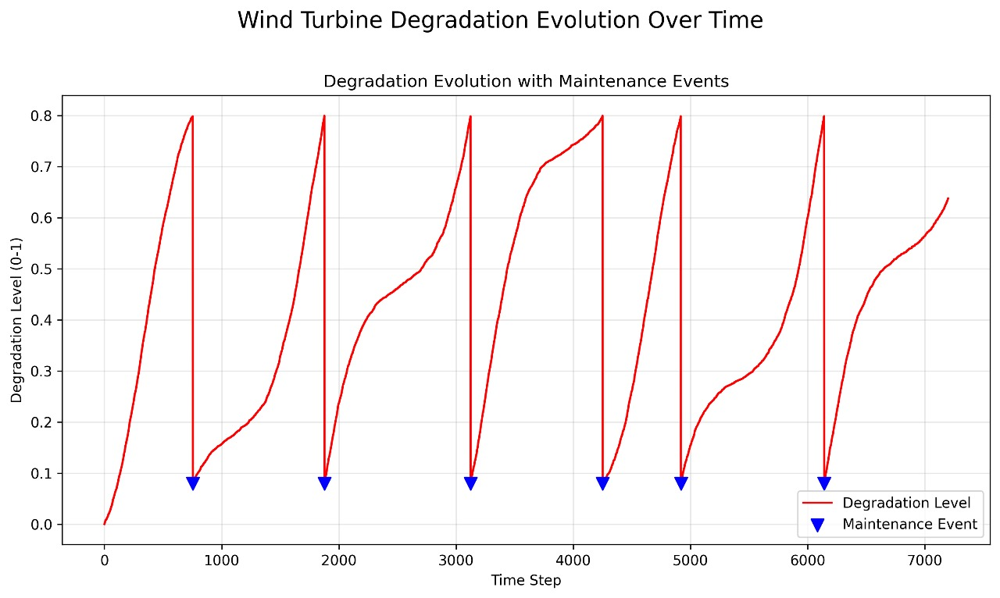

Synthetic Data Generation
=========================

As outlined in :doc:`problem_statement`, due to computational limitations,
it's not feasible to simulate a wind turbine's degradation over an extensive
period using only the detailed Simulink model. To address this, we developed
a **synthetic data generator** that leverages insights from our Simulink
simulations and real weather data to create long-term operational and degradation
datasets.

This approach allows us to generate a rich dataset encompassing various
operational conditions, simulated component degradation, and maintenance events,
which is crucial for training robust predictive maintenance models.

Wind Turbine Degradation Simulator (`WindTurbineDegradationSimulator` Class)
-------------------------------------------------------------------------

The core of our synthetic data generation is the `WindTurbineDegradationSimulator`
Python class. This class simulates the operational behavior of a wind turbine
and models the progression of component degradation over time, including the
impact of maintenance.

The simulator integrates:

* **Turbine Aerodynamics:** Calculates rotor RPM, tip-speed ratio (TSR),
    and power coefficient (Cp) based on wind speed.
* **System Dynamics:** Derives system torque and generator speed.
* **Degradation Model:** A physics-informed model that accumulates degradation
    based on various environmental and operational stressors.
* **Maintenance Logic:** Simulates the effect of maintenance events in
    reducing degradation when certain thresholds are met.

Below is the Python code for the `WindTurbineDegradationSimulator` class:

.. literalinclude:: ../NoteBookDATA/WindTurbineDegradationSimulator.py
   :language: python
   :linenos
   :caption: WindTurbineDegradationSimulator.py

Explanation of Key Methods:
---------------------------

* **`__init__(self)`**: Initializes the simulator with various turbine
    physical parameters and degradation/maintenance settings.
* **`calculate_rotor_rpm(self, wind_speed)`**: Computes the rotor's rotational
    speed based on the incoming wind and turbine design parameters.
* **`calculate_cp(self, tsr, pitch_angle=0)`**: Calculates the power coefficient,
    which indicates how efficiently the turbine converts wind energy into mechanical power.
* **`calculate_system_torque(self, wind_speed)`**: Determines the mechanical
    torque and generator speed generated by the turbine given the wind conditions.
* **`simple_cycle_factor(self, temp_data_input)`**: Estimates a fatigue-related
    "cycle factor" based on temperature fluctuations, contributing to degradation.
* **`wind_turbine_generator_degradation(self, ...)`**: The central degradation
    model. It calculates the increase in degradation at each time step based on
    mechanical wear (from torque/speed), vibration stress, thermal stress (from temperature),
    humidity stress, and the calculated cycle factor. It also incorporates maintenance logic,
    reducing degradation once a certain threshold is reached and enough time has passed
    since the last maintenance.
* **`process_time_series(self, csv_file_path=None, df=None)`**: This is the main
    function that takes input weather/operational data (from a CSV or DataFrame)
    and iterates through it, applying the degradation model and tracking maintenance.
    It expects 'speed' or 'u'/'v' for wind, 'U' for vibration, 'r' for humidity, and
    'temperature'. If some are missing, it uses defaults or synthetic estimates.
* **`plot_degradation_analysis(self, df, save_path=None)`**: Generates and
    displays a series of plots analyzing the simulation results, including
    degradation over time, torque vs. wind speed, temperature profile, etc.
* **`print_degradation_summary(self, df)`**: Provides a textual summary of
    the degradation simulation, including final degradation level, total maintenance
    events, and time since last maintenance.

Structure of Generated Data
---------------------------

The `process_time_series` method produces a comprehensive DataFrame that combines
the input weather/operational data with the newly simulated degradation metrics.
The output DataFrame includes (but is not limited to) the following key columns:

* **Original Input Columns:** All columns from your initial input CSV (e.g., `Time (s)`, `U`, `V`, `Y` from your image, `speed`, `temperature`, `r`).
* **`system_torque_knm`**: The simulated mechanical torque on the system, in kNm.
* **`generator_speed_rpm`**: The simulated rotational speed of the generator, in RPM.
* **`degradation`**: The cumulative degradation level of the turbine component, a value typically between 0 (no degradation) and 1 (full degradation/failure). This is the primary target for predictive maintenance.
* **`cycle_factor`**: A calculated factor representing accumulated stress from thermal cycles or other repetitive loads.
* **`maintenance_performed`**: A cumulative count of maintenance events that have occurred throughout the simulation. Each time maintenance is "performed", this count increments.
* **`time_since_last_maintenance`**: The number of time steps (e.g., minutes/hours) that have passed since the last simulated maintenance event. This is crucial for models to understand maintenance cycles.
* **`temperature_estimated`**: (If original 'temperature' column was missing) The synthetically generated temperature profile.

This generated dataset is then used to train the predictive maintenance models in the Dashboard application.

